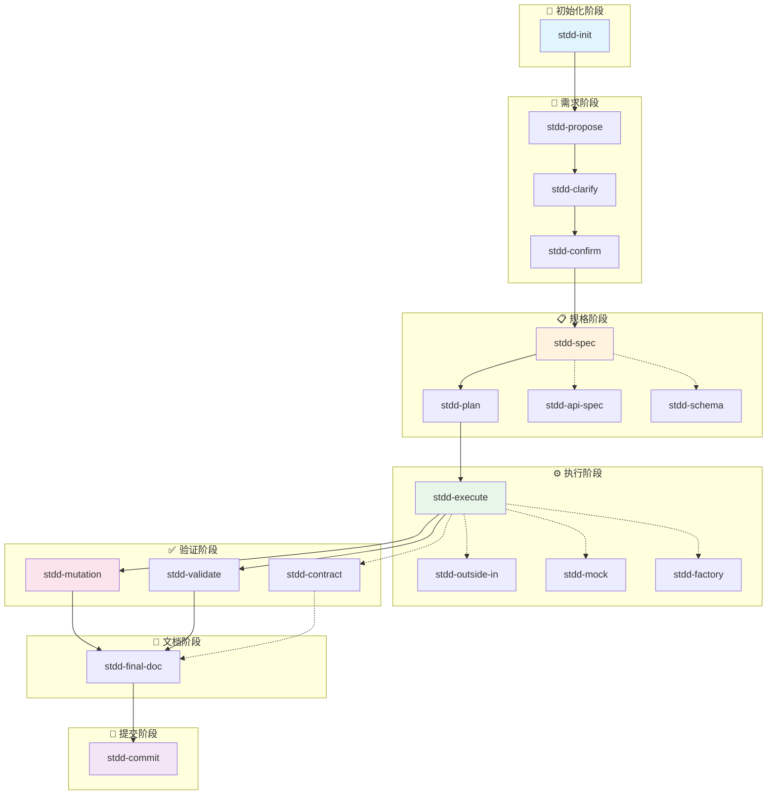

# STDD Skill Graph 引擎 (/stdd:graph)

## 目标
提供统一的 Skill Graph 引擎，支持可视化分析、智能编排、并行调度和执行追踪，实现 Skill 之间的自动化协作。

---

## 核心架构

```
┌─────────────────────────────────────────────────────────────────────────┐
│                        Skill Graph Engine                                │
├─────────────────────────────────────────────────────────────────────────┤
│                                                                          │
│   ┌─────────────┐   ┌─────────────┐   ┌─────────────┐   ┌─────────────┐│
│   │  Visualizer │   │  Analyzer   │   │  Scheduler  │   │   Tracker   ││
│   │  可视化引擎  │   │  分析引擎   │   │  调度引擎   │   │  追踪引擎   ││
│   └──────┬──────┘   └──────┬──────┘   └──────┬──────┘   └──────┬──────┘│
│          │                 │                 │                 │        │
│          └─────────────────┴─────────────────┴─────────────────┘        │
│                                     │                                    │
│                          ┌──────────┴──────────┐                        │
│                          │   Graph Definition  │                        │
│                          │   (YAML 格式)       │                        │
│                          └─────────────────────┘                        │
│                                     │                                    │
│   ┌─────────────┐   ┌─────────────┐   ┌─────────────┐   ┌─────────────┐│
│   │  Condition  │   │  Parallel   │   │  Executor   │   │Recommender  ││
│   │  条件引擎   │   │  并行器     │   │  执行器     │   │  推荐器     ││
│   └─────────────┘   └─────────────┘   └─────────────┘   └─────────────┘│
│                                                                          │
└─────────────────────────────────────────────────────────────────────────┘
```

---

## 使用方式

### 可视化 Skill Graph

```bash
# 生成 Mermaid 图
/stdd:graph visualize

# 生成 HTML 可交互图
/stdd:graph visualize --format=html

# 仅显示特定层级
/stdd:graph visualize --level=spec
/stdd:graph visualize --level=execution

# 输出到文件
/stdd:graph visualize --output=graph.svg
```

### 分析当前状态

```bash
# 分析当前执行状态
/stdd:graph analyze

# 分析特定 Skill 的依赖
/stdd:graph analyze --skill=stdd-execute

# 分析可执行路径
/stdd:graph analyze --paths

# 分析瓶颈
/stdd:graph analyze --bottlenecks
```

### 运行 Skill Graph

```bash
# 从指定 Skill 开始执行
/stdd:graph run stdd-spec

# 从头开始完整流程
/stdd:graph run stdd-init --full

# 跳过已完成的步骤
/stdd:graph run stdd-execute --skip-completed

# 干运行模式（仅显示计划）
/stdd:graph run stdd-plan --dry-run
```

### 并行执行

```bash
# 识别可并行的 Skill
/stdd:graph parallel --detect

# 执行可并行的 Skill
/stdd:graph parallel --execute

# 设置并行度
/stdd:graph parallel --max-workers=4

# 并行执行特定组
/stdd:graph parallel --group=testing
```

### 执行历史

```bash
# 查看所有历史
/stdd:graph history

# 查看最近 N 次
/stdd:graph history --last=10

# 查看特定 Skill 的历史
/stdd:graph history --skill=stdd-execute

# 查看失败记录
/stdd:graph history --failures
```

### 回放执行

```bash
# 回放指定执行 ID
/stdd:graph replay exec-20260327-001

# 回放并重新执行
/stdd:graph replay exec-20260327-001 --re-execute

# 回放特定步骤
/stdd:graph replay exec-20260327-001 --from=3 --to=5
```

### 智能推荐

```bash
# 获取下一步推荐
/stdd:graph recommend

# 基于当前上下文推荐
/stdd:graph recommend --context=current

// 基于目标推荐
/stdd:graph recommend --goal="完成用户认证功能"
```

---

## Graph 定义格式

### YAML 格式

文件位置: `stdd/graph/skills.yaml`

```yaml
version: "1.0"
name: "STDD Copilot Skill Graph"
description: "Specification & Test-Driven Development Workflow"

# 全局配置
config:
  max_parallel: 4
  timeout: 3600
  retry_count: 3
  on_failure: "rollback"

# 条件变量
variables:
  project_type: "${PROJECT_TYPE:-node}"
  test_framework: "${TEST_FRAMEWORK:-vitest}"
  has_database: "${HAS_DATABASE:-false}"

# Skill 节点定义
skills:
  # ========== 初始化阶段 ==========
  stdd-init:
    description: "初始化环境与插件记忆库"
    phase: init
    timeout: 300
    outputs:
      - "stdd/memory/foundation.md"
      - "stdd/memory/components.md"
    next:
      - stdd-propose
    metadata:
      priority: required
      category: setup

  # ========== 需求阶段 ==========
  stdd-propose:
    description: "提出原始需求草案"
    phase: propose
    inputs:
      - "user_request"
    outputs:
      - "stdd/drafts/proposal.md"
    next:
      - stdd-clarify
    metadata:
      priority: required
      category: requirement

  stdd-clarify:
    description: "系统主动交互澄清"
    phase: clarify
    inputs:
      - "stdd/drafts/proposal.md"
    outputs:
      - "stdd/drafts/clarification.json"
    next:
      - stdd-confirm
    metadata:
      priority: required
      category: requirement
      interactive: true

  stdd-confirm:
    description: "人类确认需求"
    phase: confirm
    inputs:
      - "stdd/drafts/clarification.json"
    outputs:
      - "stdd/approved/requirement.md"
    next:
      - stdd-spec
    condition: "${clarification_complete} == true"
    metadata:
      priority: required
      category: requirement
      gate: human_approval

  # ========== 规格阶段 ==========
  stdd-spec:
    description: "生成 BDD 规格"
    phase: spec
    inputs:
      - "stdd/approved/requirement.md"
    outputs:
      - "stdd/specs/features/"
      - "stdd/specs/scenarios/"
    next:
      - stdd-plan
    metadata:
      priority: required
      category: specification

  stdd-plan:
    description: "极细微任务拆解"
    phase: plan
    inputs:
      - "stdd/specs/features/"
    outputs:
      - "stdd/plans/tasks.md"
      - "stdd/plans/dependencies.json"
    next:
      - stdd-execute
    metadata:
      priority: required
      category: planning

  # ========== 执行阶段 ==========
  stdd-execute:
    description: "执行 TDD 循环"
    phase: execute
    inputs:
      - "stdd/plans/tasks.md"
    outputs:
      - "src/"
      - "tests/"
    next:
      - stdd-final-doc
    parallel_with:
      - stdd-mutation
      - stdd-validate
    metadata:
      priority: required
      category: execution
      ralph_loop: true

  stdd-apply:
    description: "开始实现"
    phase: execute
    inputs:
      - "stdd/plans/tasks.md"
    outputs:
      - "src/"
    metadata:
      priority: optional
      category: execution

  # ========== 验证阶段 (可并行) ==========
  stdd-mutation:
    description: "变异测试"
    phase: verify
    inputs:
      - "tests/"
      - "src/"
    outputs:
      - "stdd/reports/mutation.html"
    metadata:
      priority: medium
      category: testing
      parallel_group: verification

  stdd-validate:
    description: "规范验证"
    phase: verify
    inputs:
      - "stdd/specs/"
      - "src/"
    outputs:
      - "stdd/reports/validation.json"
    metadata:
      priority: medium
      category: verification
      parallel_group: verification

  stdd-contract:
    description: "契约测试"
    phase: verify
    inputs:
      - "stdd/contracts/"
    outputs:
      - "stdd/reports/contract.json"
    condition: "${has_api} == true"
    metadata:
      priority: medium
      category: testing
      parallel_group: verification

  # ========== 文档阶段 ==========
  stdd-final-doc:
    description: "生成最终需求文档"
    phase: document
    inputs:
      - "stdd/approved/requirement.md"
      - "stdd/specs/"
      - "src/"
    outputs:
      - "FINAL_REQUIREMENT.md"
    next:
      - stdd-commit
    metadata:
      priority: required
      category: documentation

  # ========== 提交阶段 ==========
  stdd-commit:
    description: "原子化打包与提交"
    phase: commit
    inputs:
      - "src/"
      - "tests/"
      - "FINAL_REQUIREMENT.md"
    outputs:
      - "git commits"
    metadata:
      priority: required
      category: deployment

  # ========== SDD 增强技能 ==========
  stdd-api-spec:
    description: "API 规范先行"
    phase: spec
    outputs:
      - "stdd/specs/openapi.yaml"
      - "stdd/types/api.ts"
    condition: "${has_api} == true"
    metadata:
      priority: high
      category: sdd

  stdd-schema:
    description: "类型规范先行"
    phase: spec
    outputs:
      - "stdd/schemas/"
      - "stdd/types/"
    metadata:
      priority: high
      category: sdd

  # ========== TDD 增强技能 ==========
  stdd-outside-in:
    description: "外向内 TDD"
    phase: execute
    metadata:
      priority: high
      category: tdd

  stdd-mock:
    description: "自动 Mock 生成"
    phase: execute
    outputs:
      - "src/__mocks__/"
    metadata:
      priority: medium
      category: tdd

  stdd-factory:
    description: "测试数据工厂"
    phase: execute
    outputs:
      - "src/__tests__/factories/"
    metadata:
      priority: medium
      category: tdd

  # ========== 辅助技能 ==========
  stdd-turbo:
    description: "一键通扫模式"
    phase: all
    metadata:
      priority: low
      category: convenience

  stdd-guard:
    description: "TDD 守护钩子"
    phase: all
    hook: true
    metadata:
      priority: high
      category: guard

  stdd-prp:
    description: "PRP 结构化规划"
    phase: plan
    metadata:
      priority: high
      category: planning

  stdd-supervisor:
    description: "多 Agent 协调器"
    phase: execute
    metadata:
      priority: high
      category: coordination

  stdd-context:
    description: "三层文档架构"
    phase: all
    metadata:
      priority: high
      category: context

  stdd-iterate:
    description: "自主迭代循环"
    phase: execute
    metadata:
      priority: medium
      category: iteration

  stdd-memory:
    description: "向量数据库记忆"
    phase: all
    metadata:
      priority: low
      category: memory

  stdd-parallel:
    description: "并行执行模式"
    phase: execute
    metadata:
      priority: medium
      category: execution

  stdd-roles:
    description: "多角色协作"
    phase: all
    metadata:
      priority: medium
      category: collaboration

  stdd-metrics:
    description: "质量指标仪表板"
    phase: verify
    metadata:
      priority: low
      category: metrics

  stdd-learn:
    description: "自适应学习系统"
    phase: all
    metadata:
      priority: low
      category: learning

# 依赖关系
dependencies:
  stdd-spec:
    requires:
      - stdd-confirm
    optional:
      - stdd-api-spec
      - stdd-schema

  stdd-plan:
    requires:
      - stdd-spec

  stdd-execute:
    requires:
      - stdd-plan
    optional:
      - stdd-outside-in
      - stdd-mock
      - stdd-factory

  stdd-final-doc:
    requires:
      - stdd-execute

  stdd-commit:
    requires:
      - stdd-final-doc
      - stdd-mutation
      - stdd-validate

# 并行组定义
parallel_groups:
  verification:
    skills:
      - stdd-mutation
      - stdd-validate
      - stdd-contract
    strategy: "all"  # all, any, race

  specification:
    skills:
      - stdd-api-spec
      - stdd-schema
    strategy: "all"

# 条件规则
conditions:
  clarification_complete:
    type: "file_exists"
    path: "stdd/drafts/clarification.json"

  has_api:
    type: "file_pattern"
    pattern: "src/api/**/*.ts"

  has_database:
    type: "file_pattern"
    pattern: "**/migrations/**/*.sql"

  tests_pass:
    type: "command"
    command: "npm test"
    expected: "exit_code:0"

# 钩子定义
hooks:
  pre_execute:
    - skill: stdd-guard
      condition: "always"

  post_execute:
    - skill: stdd-metrics
      condition: "tests_pass"

  on_failure:
    - skill: stdd-iterate
      max_retries: 3
```

---

## 可视化输出示例

### Mermaid 图

```bash
/stdd:graph visualize
```

输出:



### HTML 可交互图

```bash
/stdd:graph visualize --format=html
```

生成可交互的 HTML 页面，支持:
- 节点点击查看详情
- 缩放和平移
- 高亮当前执行路径
- 显示依赖关系
- 实时状态更新

---

## 分析输出示例

### 状态分析

```bash
/stdd:graph analyze
```

输出:

```
📊 Skill Graph 分析报告

━━━━━━━━━━━━━━━━━━━━━━━━━━━━━━━━━━━━━━━━

📈 执行状态

┌─────────────┬───────┬─────────────┐
│ 阶段        │ 状态  │ 进度        │
├─────────────┼───────┼─────────────┤
│ Init        │ ✅    │ 100%        │
│ Requirement │ ✅    │ 100%        │
│ Spec        │ ✅    │ 100%        │
│ Execute     │ 🔄    │ 67%         │
│ Verify      │ ⏳    │ 0%          │
│ Document    │ ⏳    │ 0%          │
│ Commit      │ ⏳    │ 0%          │
└─────────────┴───────┴─────────────┘

当前执行: stdd-execute (Ralph Loop 迭代 2/3)

━━━━━━━━━━━━━━━━━━━━━━━━━━━━━━━━━━━━━━━━

🔗 依赖关系

已完成:
  ✅ stdd-init
  ✅ stdd-propose
  ✅ stdd-clarify
  ✅ stdd-confirm
  ✅ stdd-spec
  ✅ stdd-plan

进行中:
  🔄 stdd-execute
    ├── 测试: 12/18 通过
    └── 实现: 8/12 完成

阻塞中:
  ⏳ stdd-mutation (等待 stdd-execute)
  ⏳ stdd-validate (等待 stdd-execute)
  ⏳ stdd-final-doc (等待验证完成)

━━━━━━━━━━━━━━━━━━━━━━━━━━━━━━━━━━━━━━━━

⚡ 可并行执行

当前无阻塞，以下 Skill 可并行执行:
  • stdd-mock (生成 Mock 文件)
  • stdd-factory (生成测试数据工厂)

建议命令:
  /stdd:graph parallel --execute

━━━━━━━━━━━━━━━━━━━━━━━━━━━━━━━━━━━━━━━━

🎯 下一步推荐

1. [高优先] 完成 stdd-execute 的 Ralph Loop
   - 还有 6 个测试未通过
   - 还有 4 个实现待完成

2. [建议] 并行生成辅助代码
   /stdd:graph parallel --group=testing

3. [准备] 预生成验证配置
   /stdd:mutation config --threshold=80
```

### 路径分析

```bash
/stdd:graph analyze --paths
```

输出:

```
🔀 可执行路径分析

━━━━━━━━━━━━━━━━━━━━━━━━━━━━━━━━━━━━━━━━

📍 从当前位置 (stdd-execute) 的可能路径:

路径 1: 标准流程 (推荐)
  stdd-execute → stdd-mutation → stdd-validate → stdd-final-doc → stdd-commit
  预计时间: ~45 分钟
  依赖: 无阻塞

路径 2: 完整验证
  stdd-execute → [stdd-mutation, stdd-validate, stdd-contract] → stdd-final-doc → stdd-commit
  预计时间: ~60 分钟
  依赖: 需要 API 契约

路径 3: 快速通道
  stdd-execute → stdd-final-doc → stdd-commit
  预计时间: ~30 分钟
  风险: 跳过变异测试和规范验证

━━━━━━━━━━━━━━━━━━━━━━━━━━━━━━━━━━━━━━━━

⚠️ 阻塞路径

路径 4: 带契约测试
  stdd-contract → stdd-commit
  阻塞原因: stdd-api-spec 未执行
  解决: 先执行 /stdd:api-spec
```

---

## 并行执行示例

### 检测可并行 Skill

```bash
/stdd:graph parallel --detect
```

输出:

```
⚡ 并行分析结果

━━━━━━━━━━━━━━━━━━━━━━━━━━━━━━━━━━━━━━━━

🔍 可并行组

组 1: 规格生成 (可立即执行)
  ├── stdd-api-spec
  └── stdd-schema
  策略: 全部完成
  预计时间: 5 分钟

组 2: 测试辅助 (等待 stdd-execute)
  ├── stdd-mock
  ├── stdd-factory
  └── stdd-outside-in
  策略: 全部完成
  预计时间: 10 分钟

组 3: 验证 (等待 stdd-execute)
  ├── stdd-mutation
  ├── stdd-validate
  └── stdd-contract (条件: has_api)
  策略: 全部完成
  预计时间: 15 分钟

━━━━━━━━━━━━━━━━━━━━━━━━━━━━━━━━━━━━━━━━

📊 并行效率预估

顺序执行总时间: 30 分钟
并行执行总时间: 15 分钟
效率提升: 50%

建议并行度: 3 workers
```

### 执行并行任务

```bash
/stdd:graph parallel --execute --group=verification
```

输出:

```
⚡ 并行执行: verification 组

━━━━━━━━━━━━━━━━━━━━━━━━━━━━━━━━━━━━━━━━

🔄 启动中...

[Worker 1] stdd-mutation      开始...
[Worker 2] stdd-validate      开始...
[Worker 3] stdd-contract      开始...

━━━━━━━━━━━━━━━━━━━━━━━━━━━━━━━━━━━━━━━━

📈 实时进度

┌─────────────────┬──────────┬──────────┐
│ Skill           │ 状态     │ 进度     │
├─────────────────┼──────────┼──────────┤
│ stdd-mutation   │ 🔄 运行  │ 45%      │
│ stdd-validate   │ 🔄 运行  │ 62%      │
│ stdd-contract   │ ✅ 完成  │ 100%     │
└─────────────────┴──────────┴──────────┘

━━━━━━━━━━━━━━━━━━━━━━━━━━━━━━━━━━━━━━━━

✅ 并行执行完成

总耗时: 12 分 34 秒
成功率: 3/3 (100%)

结果:
  • stdd-mutation: 变异得分 89%
  • stdd-validate: 5/5 规范通过
  • stdd-contract: 3 契约通过

下一步: /stdd:final-doc
```

---

## 执行历史示例

### 查看历史

```bash
/stdd:graph history --last=5
```

输出:

```
📜 执行历史 (最近 5 次)

━━━━━━━━━━━━━━━━━━━━━━━━━━━━━━━━━━━━━━━━

执行 ID: exec-20260327-005
时间: 2026-03-27 14:32:15
状态: ✅ 成功
耗时: 45 分 12 秒
路径: stdd-init → stdd-propose → ... → stdd-commit
标签: feature/user-auth

━━━━━━━━━━━━━━━━━━━━━━━━━━━━━━━━━━━━━━━━

执行 ID: exec-20260327-004
时间: 2026-03-27 11:20:45
状态: ⚠️ 部分成功
耗时: 32 分 08 秒
路径: stdd-spec → stdd-plan → stdd-execute
失败: stdd-mutation (得分 72% < 80%)
标签: fix/export-markdown

━━━━━━━━━━━━━━━━━━━━━━━━━━━━━━━━━━━━━━━━

执行 ID: exec-20260327-003
时间: 2026-03-27 09:15:33
状态: ✅ 成功
耗时: 28 分 45 秒
路径: stdd-clarify → stdd-confirm → stdd-spec
标签: spec/api-design

━━━━━━━━━━━━━━━━━━━━━━━━━━━━━━━━━━━━━━━━

执行 ID: exec-20260326-002
时间: 2026-03-26 16:45:22
状态: ❌ 失败
耗时: 15 分 30 秒
路径: stdd-execute
失败原因: 测试超时
标签: feature/storage

━━━━━━━━━━━━━━━━━━━━━━━━━━━━━━━━━━━━━━━━

执行 ID: exec-20260326-001
时间: 2026-03-26 10:00:00
状态: ✅ 成功
耗时: 1 小时 12 分
路径: 完整流程 (init → commit)
标签: project/init

💡 操作提示:
  回放: /stdd:graph replay exec-20260327-004
  详情: /stdd:graph history --id=exec-20260327-004
```

---

## 智能推荐示例

### 基于上下文推荐

```bash
/stdd:graph recommend --context=current
```

输出:

```
🎯 Skill 推荐报告

━━━━━━━━━━━━━━━━━━━━━━━━━━━━━━━━━━━━━━━━

📍 当前上下文

项目阶段: 执行阶段
当前 Skill: stdd-execute
测试状态: 12/18 通过 (67%)
实现状态: 8/12 完成 (67%)
阻塞: 无

━━━━━━━━━━━━━━━━━━━━━━━━━━━━━━━━━━━━━━━━

💡 推荐操作 (按优先级)

1. [立即执行] 完成 Ralph Loop 迭代
   原因: 还有 6 个测试未通过
   命令: 继续当前 stdd-execute

   预计剩余时间: 15 分钟
   置信度: 95%

2. [并行准备] 生成 Mock 和 Factory
   原因: 可与实现并行，加速后续测试
   命令: /stdd:graph parallel --group=testing

   预计时间: 8 分钟 (并行)
   置信度: 88%

3. [预配置] 设置变异测试阈值
   原因: 当前测试覆盖较低，建议调低阈值
   命令: /stdd:mutation config --threshold=70

   预计时间: 2 分钟
   置信度: 75%

━━━━━━━━━━━━━━━━━━━━━━━━━━━━━━━━━━━━━━━━

🔮 预测路径

最优路径 (89% 置信度):
  1. 完成 stdd-execute (~15 分钟)
  2. 并行验证 (~12 分钟)
  3. 生成文档 (~5 分钟)
  4. 提交代码 (~3 分钟)

总预计时间: 35 分钟
成功概率: 89%

━━━━━━━━━━━━━━━━━━━━━━━━━━━━━━━━━━━━━━━━

⚠️ 风险提示

1. 变异测试可能不达标
   当前测试质量预估: 72%
   建议: 添加更多边界测试

2. API 契约未验证
   原因: stdd-api-spec 未执行
   建议: 验证阶段跳过 stdd-contract

━━━━━━━━━━━━━━━━━━━━━━━━━━━━━━━━━━━━━━━━

📈 学习建议

基于历史执行分析:
  • 你的变异测试得分平均: 76%
  • 建议: 使用 /stdd:factory 生成更多测试数据
  • 建议: 使用 /stdd:mutation --operators=conditional

执行效率:
  • 平均 Ralph Loop 迭代: 2.3 次
  • 建议: 测试先行，减少迭代次数
```

---

## 配置

### Graph 配置文件

文件位置: `stdd/graph/config.json`

```json
{
  "version": "1.0",
  "graphFile": "stdd/graph/skills.yaml",
  "historyDir": "stdd/history",
  "maxParallelWorkers": 4,
  "defaultTimeout": 3600000,
  "retryPolicy": {
    "maxRetries": 3,
    "backoffMs": 1000,
    "multiplier": 2
  },
  "visualization": {
    "defaultFormat": "mermaid",
    "htmlTemplate": "stdd/templates/graph.html",
    "theme": "light"
  },
  "tracking": {
    "enabled": true,
    "snapshotInterval": 60000,
    "maxHistoryEntries": 100
  },
  "recommendations": {
    "enabled": true,
    "minConfidence": 0.7,
    "contextWindow": 5
  }
}
```

### 条件引擎配置

文件位置: `stdd/graph/conditions.json`

```json
{
  "evaluators": {
    "file_exists": {
      "type": "filesystem",
      "cache": true,
      "ttl": 5000
    },
    "file_pattern": {
      "type": "glob",
      "cache": true,
      "ttl": 10000
    },
    "command": {
      "type": "shell",
      "timeout": 30000,
      "allowedCommands": ["npm", "git", "node"]
    },
    "variable": {
      "type": "env",
      "allowOverride": true
    }
  },
  "hooks": {
    "onConditionMet": [],
    "onConditionFailed": []
  }
}
```

---

## 与其他 Skill 集成

```
STDD 工作流集成:

/stdd:init
    │
    └──► 初始化 Graph 配置
            │
            ▼
/stdd:graph analyze
    │
    ├──► 显示可用路径
    │
    └──► 推荐下一步
            │
            ▼
/stdd:execute
    │
    ├──► /stdd:graph parallel --execute (并行辅助)
    │
    └──► /stdd:guard (TDD 守护)
            │
            ▼
/stdd:graph history
    │
    └──► 记录执行历史
            │
            ▼
/stdd:graph recommend
    │
    └──► 智能推荐优化
```

---

## API 参考

### Graph Engine API

```typescript
interface SkillGraphEngine {
  // 可视化
  visualize(options: VisualizeOptions): Promise<VisualizationResult>;

  // 分析
  analyze(options: AnalyzeOptions): Promise<AnalysisResult>;

  // 执行
  run(skill: string, options: RunOptions): Promise<ExecutionResult>;

  // 并行
  parallel(options: ParallelOptions): Promise<ParallelResult>;

  // 历史
  history(options: HistoryOptions): Promise<HistoryEntry[]>;

  // 回放
  replay(executionId: string, options: ReplayOptions): Promise<ReplayResult>;

  // 推荐
  recommend(options: RecommendOptions): Promise<Recommendation[]>;
}

interface SkillNode {
  id: string;
  description: string;
  phase: string;
  inputs: string[];
  outputs: string[];
  next: string[];
  parallelWith?: string[];
  condition?: string;
  metadata: SkillMetadata;
}

interface ExecutionResult {
  executionId: string;
  status: 'success' | 'partial' | 'failed';
  duration: number;
  skills: SkillExecution[];
  error?: Error;
}
```

---

> **引用**: 借鉴自 DAG 调度系统、Workflow Engine 和 Apache Airflow
