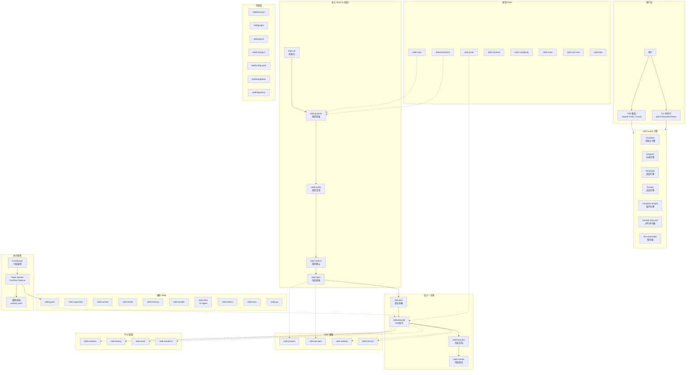

# STDD Copilot 系统架构

version: "2.0"
last_updated: "2026-04-02"

## 概述

STDD Copilot 是一套基于 **Skill Graph（技能图谱）** 的全链路自动化开发框架，将 **Spec-First (需求规范优先)** 与 **TDD (测试驱动开发)** 深度融合。包含 38 个 Skills、12 个 Agent 角色、9 篇 Constitution 条例、以及完整的 Hook Enforcement System。

---

## 系统架构图



---

## 核心组件说明

### 1. Skill Graph 引擎

| 组件 | 职责 | 输入 | 输出 |
|------|------|------|------|
| **Visualizer** | 生成依赖图可视化 | YAML Graph 定义 | Mermaid/HTML 图 |
| **Analyzer** | 分析状态和路径 | 当前状态、Graph 定义 | 分析报告、路径列表 |
| **Scheduler** | 调度 Skill 执行 | 任务列表、依赖关系 | 执行计划 |
| **Tracker** | 追踪执行历史 | 执行事件 | 历史记录 |
| **Condition Engine** | 条件判断 | 条件表达式 | 布尔结果 |
| **Parallel Executor** | 并行执行无依赖任务 | 任务列表 | 并行执行结果 |
| **Recommender** | 智能推荐 | 上下文、历史 | 推荐列表 |

### 2. 核心 Skills (5 阶段工作流)

| 阶段 | Skill | 职责 |
|------|------|------|
| **Phase 1: Proposal** | `/stdd:propose` | 提出需求草案 |
| | `/stdd:clarify` | 多轮需求澄清 (78 种结构化推理方法) |
| | `/stdd:confirm` | 人类确认门 |
| **Phase 2: Specification** | `/stdd:spec` | 生成 BDD 规格 + Test Pipeline |
| **Phase 3: Design** | `/stdd:plan` | 任务微隔离拆解 + ADR 记录 |
| **Phase 4: Implementation** | `/stdd:execute` | Ralph Loop TDD 执行 |
| | `/stdd:apply` | 选择微任务执行 |
| **Phase 5: Verification** | `/stdd:final-doc` | 生成最终文档 |
| | `/stdd:commit` | 原子化提交 (red:/green:/refactor: 前缀) |

### 3. SDD 增强 Skills

| Skill | 职责 | 触发条件 |
|------|------|----------|
| `/stdd:api-spec` | OpenAPI/TypeScript 规范生成 | 有 API 需求 |
| `/stdd:schema` | JSON Schema/Zod 类型生成 | 有类型定义需求 |
| `/stdd:contract` | 消费者驱动契约测试 (5 种消息模式) | 有 API 契约 |
| `/stdd:validate` | 规范一致性验证 + 3D 验证 + Spec Guardian | 规格完成后 |

### 4. TDD 增强 Skills

| Skill | 职责 | 与核心流程集成 |
|------|------|------------------|
| `/stdd:outside-in` | E2E → 集成 → 单元 层层推进 | Execute 阶段可选 |
| `/stdd:mock` | 自动 Mock 生成 | Execute 阶段并行 |
| `/stdd:factory` | 测试数据工厂 (Builder/Faker/Nested Fixture) | Execute 阶段并行 |
| `/stdd:mutation` | 变异测试 (Quick AI + Deep Stryker 双模式) | Verify 阶段执行 |

### 5. 辅助 Skills

| Skill | 类型 | 职责 |
|------|------|------|
| `/stdd:guard` | Hook | TDD 守护钩子 + Anti-Bypass 防绕过 |
| `/stdd:prp` | 规划 | What/Why/How/Success 规划 |
| `/stdd:supervisor` | 协调 | Supervisor 多 Agent 协调 |
| `/stdd:context` | 上下文 | 三层文档架构加载 |
| `/stdd:iterate` | 迭代 | Plan-Execute-Reflect 循环 |
| `/stdd:memory` | 记忆 | 向量数据库语义搜索 |
| `/stdd:parallel` | 执行 | DAG 并行执行 |
| `/stdd:roles` | 协作 | 12 Agent 角色协作 (4 基础 + 8 专用) |
| `/stdd:metrics` | 指标 | 质量指标仪表板 |
| `/stdd:learn` | 学习 | 自适应学习 + Pattern Teaching |
| `/stdd:turbo` | 流水线 | One-Shot 一键全流程 |
| `/stdd:brainstorm` | 分析 | 纯分析建议模式 (多角度) |
| `/stdd:issue` | 修复 | Bug TDD 修复流程 |
| `/stdd:certainty` | 评估 | 5 维度置信度评分 |
| `/stdd:complexity` | 质量 | APP Mass 代码质量计算 |
| `/stdd:vision` | 文档 | 项目愿景文档管理 |
| `/stdd:user-test` | 测试 | 用户测试脚本生成 |
| `/stdd:help` | 帮助 | 上下文感知帮助系统 |

---

## 存储架构

```
stdd/
├── changes/                    # 变更管理
│   ├── <change-name>/          # 活跃变更
│   │   ├── .state.yaml         # 持久计划状态
│   │   ├── proposal.md         # 需求提案
│   │   ├── specs/              # Delta Specs
│   │   ├── design.md           # 设计文档
│   │   ├── tasks.md            # 任务列表
│   │   ├── arch-decisions.md   # ADR 记录
│   │   └── implementation_log.md
│   └── archive/                # 归档变更
├── specs/                      # BDD 规格文件 (Source of Truth)
├── memory/                     # 持久化记忆
│   ├── foundation.md           # 项目基础约束
│   ├── components.md           # 组件架构
│   ├── contracts.md            # 接口契约
│   └── arch-evolution.md       # 架构演进日志
├── graph/                      # Skill Graph 配置
│   ├── skills.yaml             # Graph 节点定义
│   ├── config.json             # 引擎配置
│   └── conditions.json         # 条件引擎配置
├── config/                     # 配置文件
│   └── engines.yaml            # 22 个 AI 引擎注册
├── templates/                  # 模板系统
│   ├── starters/               # 5 种语言 Starter (TS/JS/Py/Go/Rust)
│   ├── docs-site/              # Astro+Starlight 文档站点
│   ├── devcontainer/           # DevContainer 配置
│   └── IMPLEMENTATION_ORDER.md # 实现顺序模板
├── presets/                    # 预设配置 (react/express/fastapi)
├── extensions/                 # 扩展系统 + Marketplace
├── reporters/                  # 测试报告器 (vitest/jest/pytest/go/rust/php)
├── explorations/               # 探索文档
├── history/                    # 执行历史
├── constitution/               # Constitution 豁免管理
│   ├── waivers.yaml            # 豁免记录
│   └── .waivers.lock           # 豁免锁
└── config.yaml                 # 项目主配置
```

---

## Constitution + Hook Enforcement

### 9 篇开发条例

| 优先级 | Article | 名称 | 执行方式 |
|--------|---------|------|----------|
| **Blocking** | 2 | TDD (测试先行) | Pre Hook 阻断 |
| **Blocking** | 7 | Security (安全优先) | Pre Hook 阻断 |
| **Blocking** | 9 | CI/CD (自动化流水线) | CI 门禁 |
| Warning | 1 | Library-First (优先使用成熟库) | 警告提示 |
| Warning | 3 | Small Commits (原子提交) | 警告提示 |
| Warning | 4 | Code Style (统一风格) | Hook 检查 |
| Warning | 6 | Error Handling (显式错误处理) | 建议提示 |
| Suggestion | 5 | Documentation (文档即代码) | Post Hook 建议 |
| Suggestion | 8 | Performance (性能默认) | Post Hook 建议 |

### Hook 检查流程

```
用户写入代码
     │
     ▼
┌─────────────────┐
│ PreToolUse Hook │
│ Article 2, 4, 7 │
└────────┬────────┘
         │
    ┌────┴────┐
    │         │
   PASS      FAIL → 阻断 + 错误提示
    │
    ▼
 执行写入操作
    │
    ▼
┌──────────────────┐
│ PostToolUse Hook │
│ Article 5, 6, 8  │
└────────┬─────────┘
         │
         ▼
   建议提示 (不阻断)
```

---

## Ralph Loop (TDD 循环)

```
┌──────────────────────────────────────────────────────────┐
│                    Ralph Loop                               │
│                                                            │
│  🔴 红灯       →    🔍 静态检查    →    🟢 绿灯           │
│  生成失败测试        语法/类型检查       最简实现           │
│                                                            │
│       →    🧪 伪变异审查    →    🔵 重构    →    ✅ 完成   │
│           检测骗绿灯断言       优化代码                     │
│                                                            │
│  ⚠️ 容错机制:                                               │
│     失败 1 次 → 策略调整                                     │
│     失败 2 次 → 跨模型降级 (Opus→Sonnet / Full→Baby Step)   │
│     失败 3 次 → 🔴 熔断 + 自动回滚                          │
└──────────────────────────────────────────────────────────┘
```

**5 级防跑偏防御体系**:

1. **人机确认门** - 关键决策需人类确认 (HITL 3 模式可配置)
2. **微任务隔离** - 5~6 个原子任务，降低上下文迷失
3. **连续失败回滚** - 4 阶段容错（策略调整→降级→熔断→回滚）
4. **静态质检门** - 语法/类型检查在测试前执行
5. **伪变异审查** - 检测骗绿灯断言

---

## 12 Agent 角色体系

| 类型 | 角色 | 职责 |
|------|------|------|
| **基础** | PO (Product Owner) | 需求定义、优先级排序 |
| **基础** | Developer | 代码实现、重构 |
| **基础** | Tester | 测试编写、质量保障 |
| **基础** | Reviewer | 代码审查 (含对抗式审查) |
| **专用** | Architect | 架构决策、ADR 记录 |
| **专用** | Security | 安全审计、漏洞检测 |
| **专用** | DevOps | CI/CD、部署策略 |
| **专用** | UX | 用户体验、交互设计 |
| **专用** | BA (Business Analyst) | 业务分析、流程建模 |
| **专用** | Tech Writer | 技术文档、API 文档 |
| **专用** | QA Lead | 测试策略、质量规划 |
| **专用** | Data Analyst | 数据分析、指标监控 |

---

## AI 引擎适配 (4 Tier)

| Tier | 引擎 | 兼容等级 |
|------|------|----------|
| **Tier 1** | Claude Code, Cursor, Windsurf | 完整适配 |
| **Tier 2** | Copilot, Aider, Cline, Continue, Amazon Q | 高兼容 |
| **Tier 3** | Qwen, Doubao, Baidu, Gemini, Codex, Devin, Sweep | 基础支持 |
| **Tier 4** | Augment, PearAI, Melty, Ellipsis, Bolt, Cody, Tabnine | 实验性 |

完整引擎列表见 `stdd/config/engines.yaml` (22 个引擎)。
